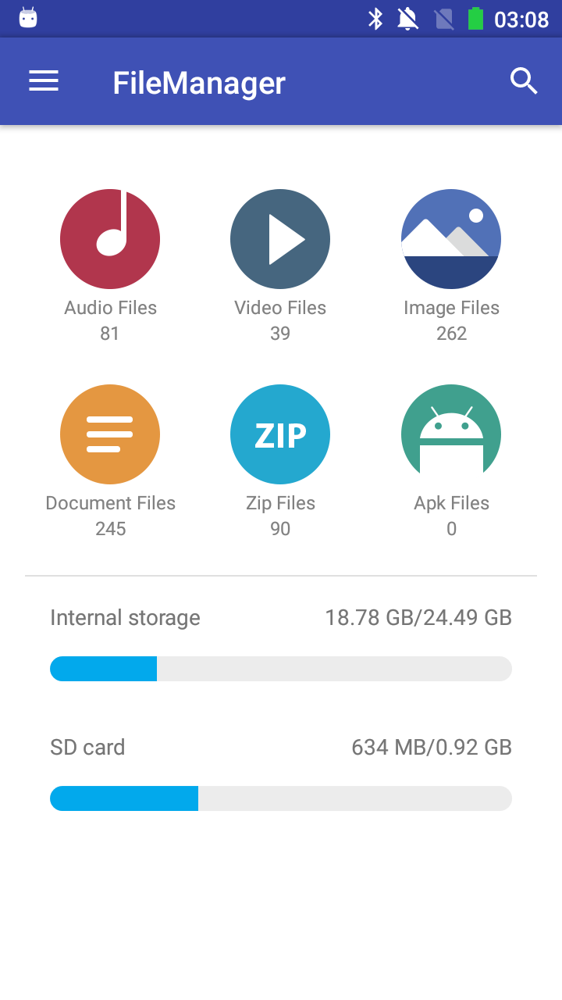
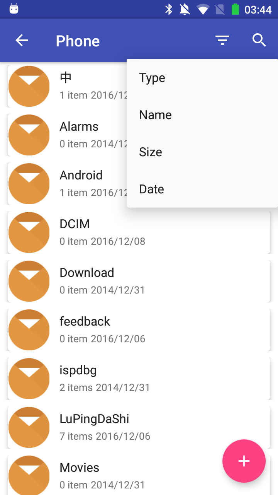

# FileManager
===================

An android open source project about "FileManager".

#Rxjava + MVP apply to this project.

附几张主界面效果图，仅供参考。

Introduction：
---
主界面暂时分为两部分：

1.分类文件总览(可显示各类文件的总量)

2.挂在设备信息总览

子页面:

1.查看音频文件

2.查看视频文件(To do)

3.查看图片文件(To do)

4.查看文档文件(To do)

5.查看压缩文件

6.查看apk文件(To do)

7.查看最近添加的文件(To do)

8.查看收藏文件(To do)

9.密码锁(To do)

---

Licence

